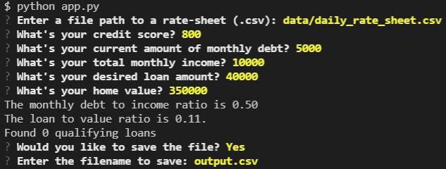
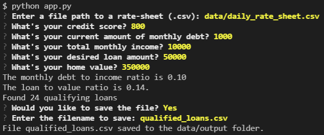
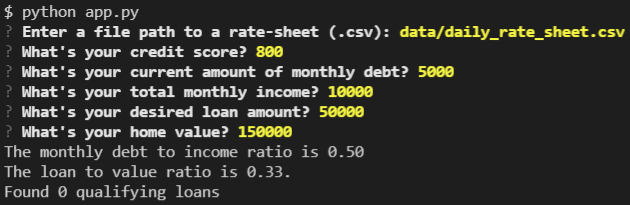

# Loan Qualifier CSV

This program will create a list of qualifying loans given user input and save the results to a csv file.

---

## Technologies

Code is written using Python version 3.8.1
The following libraries are required to run app.py:

```python
import sys
import fire
import questionary
from pathlib import Path
```

---

## Installation Guide

Using the command prompt, navigate to an empty folder where you would like to install the files and type the command:

```
git clone https://github.com/avangelinac/loan_qualifier_app.git
```
Then, to run the app type:
```
python app.py
```

---

## Screenshots

### The program creates a loan qualifier application. 




### The program creates a list of qualifying loans based on user input. The user will then be prompted to save the file:




### If the user input results in no qualifying loans, the program will exit without prompting to save:





---

## Usage

The app runs using the Command Line Interface. The user is prompted to enter a file path to a rate-sheet .csv file. The default file path is:
```
data/daily_rate_sheet.csv
```
Then, the user is prompted to enter values for their credit score, current amount of monthly debt, total monthly income, desired loan amount, and home value.

If the program generates a list of qualified loans, the user is prompted to save the file and the output is saved in the data/output folder.

---

## Contributors

Avangelina Cazares

---

## License

Not licensed. 
